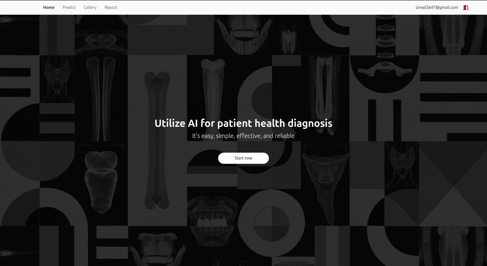
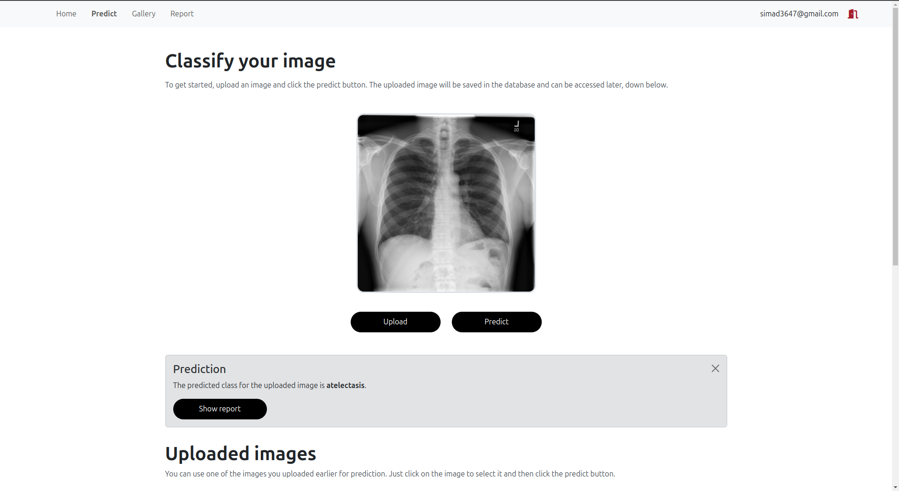
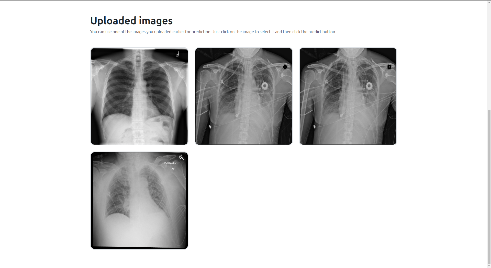
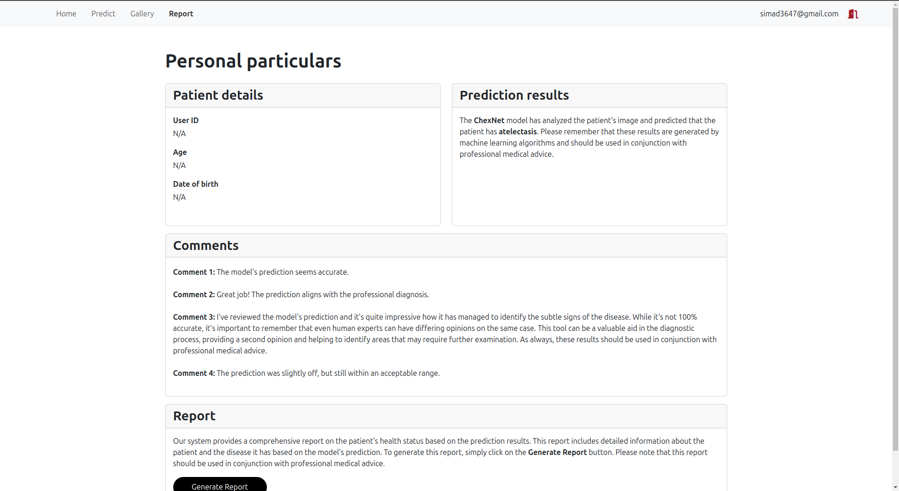
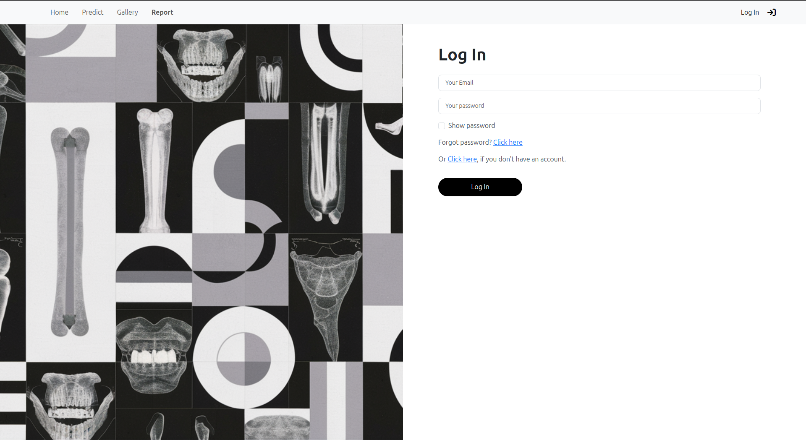
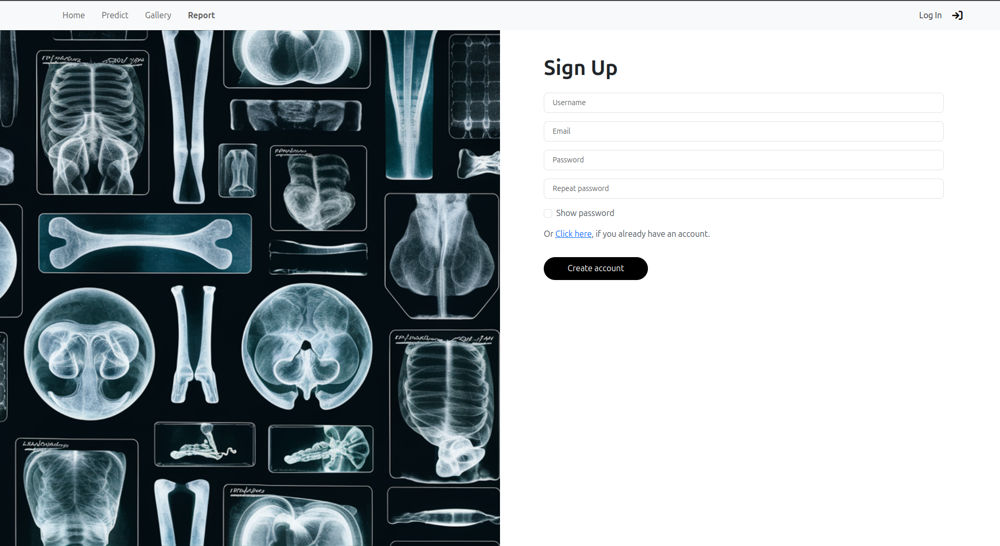

# X-Ray med-assistant

X-Ray med-assistant is a full-stack web application designed to assist medical professionals in detecting and diagnosing various chest-related diseases from X-ray images. The application uses under the hood a powerful deep learning model to identify specific conditions and provides tools for patient management and report generation.

## Features

- **User account management**:
  - Users can create accounts, and log in.
  
- **X-Ray image upload**:
  - Users can upload X-ray images.
  
- **Disease detection**:
  - The application detects the following conditions:
    - Atelectasis
    - Effusion
    - Infiltration
    - Nodule
    - Pneumonia
  
- **Prediction storage**:
  - All uploaded images and corresponding predictions are stored in the database for each user.
  
- **Report generation**:
  - Users can generate detailed reports about their patients, including detected conditions and recommendations.

## Technology Stack

- **Frontend**: Vue.js
- **Backend**: Django
- **Database**: SQLite

## Overview

### Home page

The home page is straightforward, featuring a single button that directs users to the prediction page.



### Predict page

The predict page displays content only for logged-in users.



In addition, it shows previously uploaded images stored in the database, allowing users to reuse them as needed.



### Report page

On the report page, users can modify placeholders with patient information. There’s also a button to download the report as a PDF file.



### Login page

The login page is designed for easy access.



### Sign-Up page

The sign-up page is user-friendly and intuitive.



## Installation

Follow these steps to get the project up and running:

1. Clone this repository:

   ```bash
   git clone https://github.com/ImadSaddik/X-Ray_Med-assistant.git
   ```

2. Navigate to the project directory:

   ```bash
   cd X-Ray_Med-assistant
   ```

3. Install backend dependencies (assuming you have Python and pip installed):

   ```bash
   cd backend
   pip install -r requirements.txt
   ```

4. Start Django:

   ```bash
   python manage.py runserver
   ```

5. Install frontend dependencies:

   ```bash
   cd frontend
   npm install --legacy-peer-deps
   ```

6. Start the development server:

   ```bash
   npm run serve
   ```

## Note

The deep learning model is so big that I did not add it in the backend, currently the backend just returns a specific to avoid errors.
